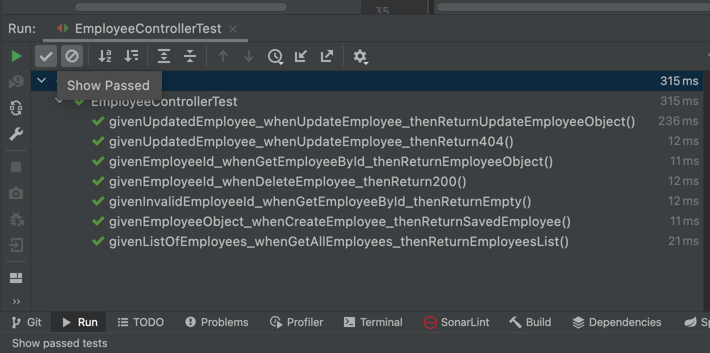

# Spring Boot Unit Testing CRUD REST API with JUnit and Mockito

The Spring Boot Starter Test dependency is a primary dependency for testing the Spring Boot Applications. It holds all
the necessary elements required for the testing.

For the Unit testing controller layer REST APIs, we are going to use the following testing libraries:

1. JUnit 5 Framework
2. Mockito 4 (Latest)
3. Hamcrest framework
4. AssertJ Library
5. JsonPath Library

### JUnit 5 Framework

It's the de facto standard testing framework for Java.

The current version of JUnit is 5+. The main goal of JUnit 5 is to support Java 8 and above, as well as enable many
different styles of testing.

Learn JUnit at https://www.javaguides.net/p/junit-5.html

### Mockito 4 (Latest)

Mockito is a mocking framework. It is a Java-based library used to create simple and basic test APIs for performing unit
testing of Java applications.

The main purpose of using the Mockito framework is to simplify the development of a test by mocking external
dependencies and using them in the test code.

Learn about the Mockito framework at https://site.mockito.org/

### Hamcrest framework

Hamcrest is the well-known framework used for unit testing in the Java ecosystem. It's bundled in JUnit and simply put,
it uses existing predicates – called matcher classes – for making assertions.

Hamcrest is commonly used with JUnit and other testing frameworks for making assertions. Specifically, instead of using
JUnit’s numerous assert methods, we only use the API's single assertThat statement with appropriate matchers.

Learn more about Hamcrest at http://hamcrest.org/JavaHamcrest/tutorial

### AssertJ Library

AssertJ is a Java library that provides a rich set of assertions and truly helpful error messages, improves test code
readability, and is designed to be super easy to use within your favorite IDE.

Spring boot starter test dependency internally provides assertj-core dependency so we don’t have to add assertj-core
dependency manually in our Spring boot project.

Read more about AssertJ at https://assertj.github.io/doc/

### JsonPath Library

A Java DSL for reading JSON documents.

JsonPath expressions always refer to a JSON structure in the same way as XPath expressions are used in combination with
an XML document. The "root member object" in JsonPath is always referred to as $ regardless of whether it is an object
or array.

Read more about JsonPath at https://github.com/json-path/JsonPath

### @WebMvcTest Annotation

SpringBoot provides @WebMvcTest annotation to test Spring MVC Controllers. Also, @WebMvcTest based test run faster
because it will load only the specified controller and its dependencies only without loading the entire application.

Spring Boot instantiates only the web layer rather than the whole application context. In an application with multiple
controllers, you can even ask for only one to be instantiated by using, for example, @WebMvcTest(HomeController.class).

### Tools and technologies used

* Java 11+
* Spring Boot
* Lombok
* JUnit 5 Framework
* Hamcrest
* AssertJ
* JsonPath
* Mockito
* IntelliJ IDEA
* Docker
* Maven

### Things todo list:

1. Clone this repository: `git clone https://github.com/hendisantika/spring-boot-unit-test-sample2.git`
2. Navigate to the folder: `cd spring-boot-unit-test-sample2`
3. Run the test: `mvn clean test`

